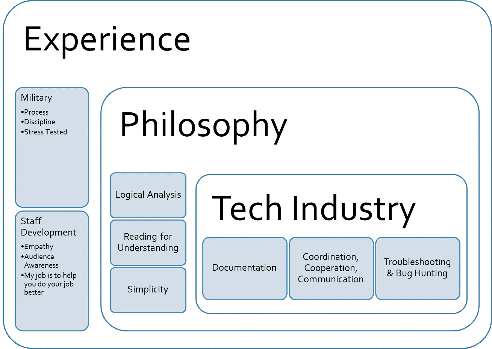
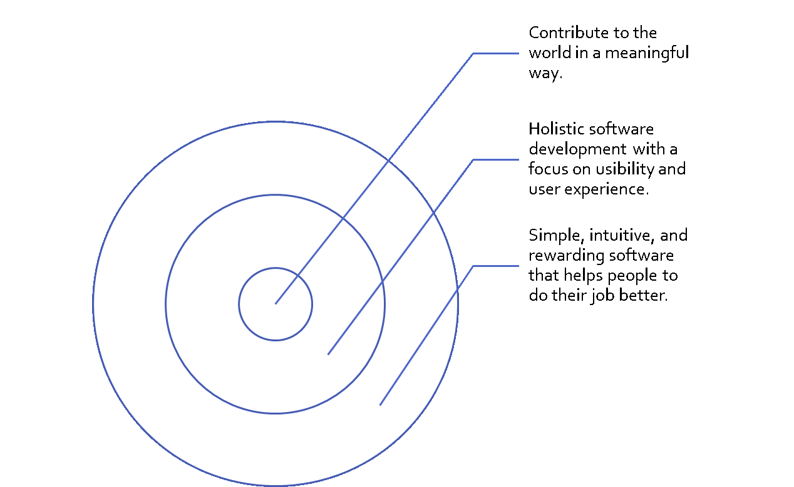
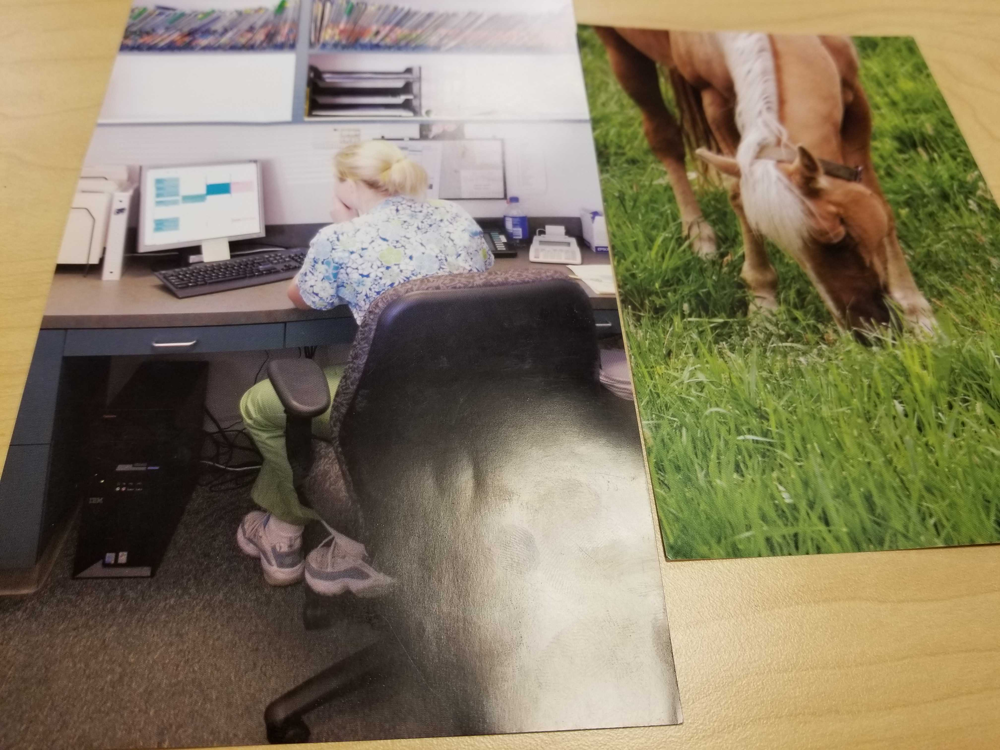

# Pro Dev

Last Updated: June 18, 2019

Career Buddy = Matthew Jones

# My Links
* [Linkedin](https://www.linkedin.com/in/alana-chigbrow-03a40996/)
* [Resume-Draft 1](docs/DRAFT1Resume.pdf)
* [Resume-Draft 2](docs/Alana-Chigbrow-Resume2.pdf)

# Pro Dev Activities

## Experience

## Why

## Accomplishments
### Quantitative
* Reduced customer turnover by 41% over the course of one quarter by creating an outreach program based on analysis of customer contacts.
* Saved the NMDOT $30k annually by leveraging in-house resources to teach Microsoft Office Suite to Engineers, Financial Analysts, and support employees.
* Turned a failing EPA inspection score of 2 into a passing score of 98 over the course of three months through coordination, training, and resource allocation for an aviation maintenance company of 120 personnel.
### Qualitative
* Driven
  * Work is completed well and on time
  * Do more than asked
  * Always looking to improve
  * Occasionally overbearing
* Perfectionist
  * Attention to detail
  * Strive for best possible product
  * Occasional procrastination
* Open Communication
  * Accurate feedback and direct
  * Less than emotionally astute
 
## Passion Project
My passion, my why, is that I want to contribute meaningfully to our world. I can best do this by building tools that help people to do their jobs better. My focus is on the scientific and educational fields. I use my 'logic' by devising tools and methods that are simple and efficient. I use my 'feeling' through empathy with my end user. What are their trials? How can I help them? What do they need/want?

I am currently in the beginning stages of designing a tool to assist with crowd sourcing data collection. My 'logic' helps me to understand the different tables I need to build and how to build the product over all. My 'feeling' helps me to understand how best to present the data visually and how to build from the user perspective.

## Identity Now & Then

I just left my last position as a Training Manager. I’ve been working in training since I graduated as a ‘hold-over’ career so that I could support my family. The first image represents the sort of mindless drudgery that is the “9-5”. 

I’m now in a position to pursue my dream of making a difference in the world through technology. I want to create rather than punching a clock. I am building my skills, knowledge, and experience in the software engineering field in order to live this dream. The second image represents happiness and freedom.

# Weekly Reflections

## Week 1
I still want to be a software engineer. I am struggling somewhat, but not so badly that I am concerned. We learn so much in a single week that I can't really say what I learned.

## Week 2
I enjoyed the maker space and the million cups. I ran into a guy who I knew when I was in elementary/middle school in Las Cruces. He's a patent attorney which is neat. It's  a small state. I'm tired, but I still want to be a developer. My career buddy is great. He's going to help me out with a couple of sound files for my project.

## Week 3
I thought the Forbidden Island exercise went well. David was unfortunately absent. Denelle and I discussed the fact that we both have to keep a hold of our natural tendencies to take charge as we are both former teachers/instructors. Anita was great at understanding the rules and getting us moving in a practical direction. She is also a good team player. I found myself helping her with a few tactical suggestions. Denelle is also a great team player and has a strong grasp of tactics. She is better than I am at holding herself. I think I'm a bit overexcited. I found myself giving a lot of suggestions. Partly, because I have played this game before. I think I did it in a diplomatic way as no one seemed upset nor did they say they were upset. I guess you'll know better as you're reading their reflections as well.
